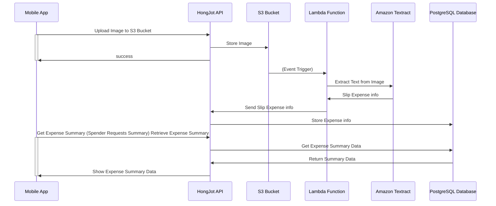

# HongJot Diagram

## Infrastructure

We have created the infrastructure by using Terraform. The infrastructure consists of the following:

- `Kubernetes Cluster (EKS)` - Managed Kubernetes Service
- `PostgreSQL (RDS)` - Relational Database (Managed Service)
- `SonarQube` - Static Code Analysis
- Github (see `.github/workflows` directory)
	- Github Action
	- Github Container Registry
- ArgoCD - Continuous Delivery
- Cloudflare - DNS Management
